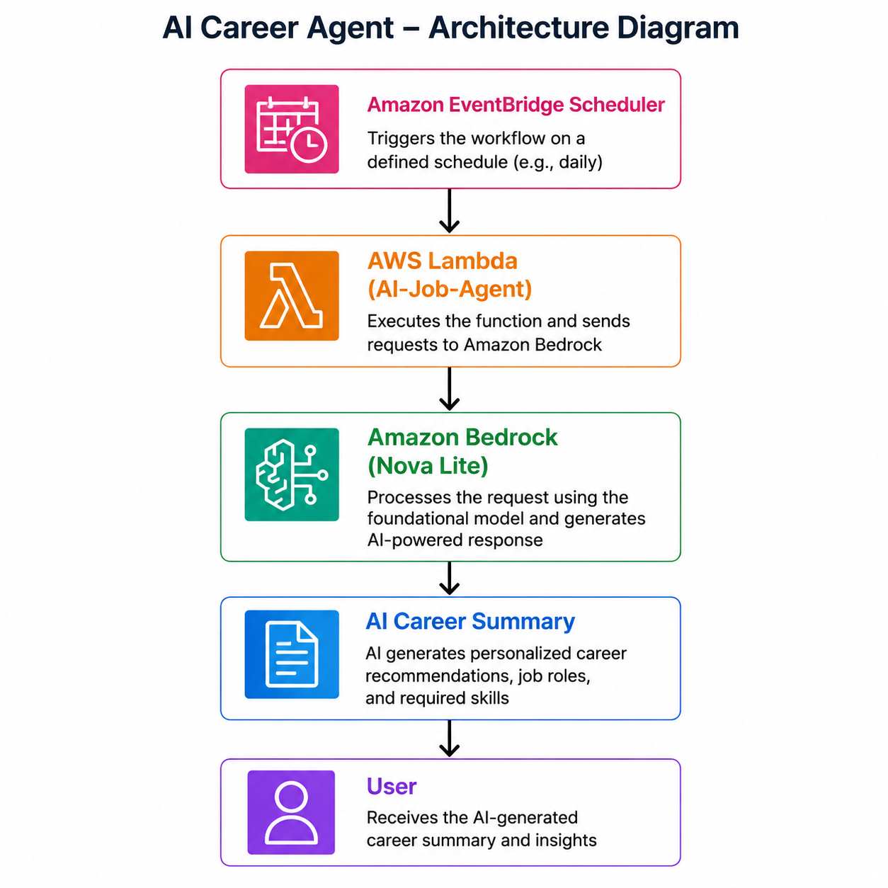

# 🚀 AI Career Agent
### AWS Weekend Agent Challenge Submission

An **Always-On AI Career Agent** built using **AWS Lambda**, **Amazon Bedrock**, and **Amazon EventBridge Scheduler** to automate AI-powered career insights. The agent is designed to run on a scheduled basis, gather relevant career information, generate intelligent summaries using Amazon Bedrock, and operate without manual intervention.

---

## 📖 Project Overview

The AI Career Agent is a serverless application developed as part of the **AWS Weekend Agent Challenge**. It demonstrates how AWS managed services can be combined to build an autonomous AI agent capable of executing recurring tasks, processing information with a Large Language Model (LLM), and providing meaningful career-focused insights.

The solution leverages an event-driven architecture where Amazon EventBridge Scheduler automatically triggers an AWS Lambda function. The Lambda function processes career-related information and utilizes **Amazon Bedrock (Nova Lite)** to generate AI-powered summaries and recommendations.

---

## ✨ Key Features

- ✅ Fully Serverless Architecture
- ✅ Automated Scheduled Execution
- ✅ AI-powered Content Generation using Amazon Bedrock
- ✅ Event-driven Workflow
- ✅ Modular Python Codebase
- ✅ Lightweight and Cost-efficient
- ✅ Easy to Extend with Email Notifications, Job APIs, and RSS Feeds

---

## 🏗️ Architecture




## ☁️ AWS Services Used

| Service | Purpose |
|----------|---------|
| **AWS Lambda** | Executes the AI Career Agent without managing servers |
| **Amazon Bedrock** | Generates AI-powered summaries and recommendations |
| **Amazon EventBridge Scheduler** | Automatically triggers the Lambda function on a schedule |
| **AWS IAM** | Securely manages permissions |
| **AWS CLI** | Deployment and AWS resource management |

---

## 📂 Project Structure

```
AI-Job-Agent/
│
├── src/
│   ├── lambda_function.py
│   ├── bedrock.py
│   ├── jobs.py
│   ├── email_sender.py
│   ├── config.py
│   ├── utils.py
│   └── hello.py
│
├── requirements.txt
└── README.md
```

---

## ⚙️ Workflow

1. Amazon EventBridge Scheduler invokes the AWS Lambda function.
2. Lambda executes the AI Career Agent.
3. The agent processes career-related information.
4. Amazon Bedrock (Nova Lite) generates an AI-powered response.
5. The generated summary is returned for further processing or future integrations.

---

## 🚀 Installation

Clone the repository

```bash
git clone https://github.com/Safiya9746/AI-Job-Agent.git
```

Navigate into the project

```bash
cd AI-Job-Agent
```

Install dependencies

```bash
pip install -r requirements.txt
```

---

## ▶️ Running Locally

```bash
python src/hello.py
```

---

## 🔮 Future Enhancements

- Integration with real-time AI job portals
- Daily AI career briefing via Amazon SES
- AI news aggregation
- Personalized job recommendations
- Resume analysis using Amazon Bedrock
- Career trend forecasting
- Dashboard for tracking opportunities

---

## 💡 Skills Demonstrated

- Serverless Computing
- Event-Driven Architecture
- Cloud Computing
- Generative AI
- Amazon Bedrock
- AWS Lambda
- EventBridge Scheduler
- Python
- AWS CLI
- Git & GitHub

---

## 👩‍💻 Author

**Safiya Anjum**

M.Tech in Data Science

Passionate about Artificial Intelligence, Machine Learning, Cloud Computing, and Generative AI.

GitHub: https://github.com/Safiya9746

---

## 📜 License

This project was developed for educational purposes as part of the **AWS Weekend Agent Challenge**.
